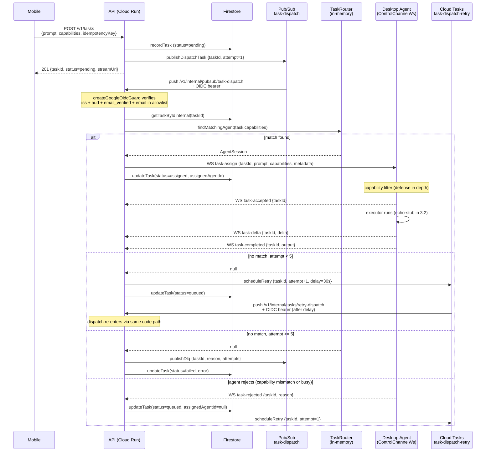
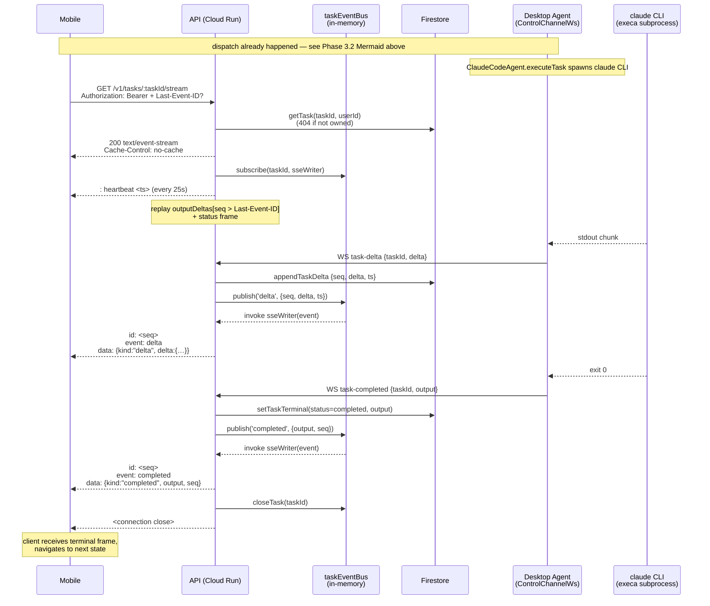

# End-to-End Task Flow

Status: Phase 3.3 closes the loop. ClaudeCodeAgent now executes
the dispatched task (Phase 1.4 + thin adapter); mobile receives
live token-stream output via Server-Sent Events from
`GET /v1/tasks/:taskId/stream`. The MVP pipeline runs end-to-end:
Mobile → api → Pub/Sub → router → WS → ClaudeCodeAgent →
`claude` CLI → tokens → bus → SSE → mobile.

The historical Phase 2 ASCII diagram below is preserved for
context. The Phase 3.2 dispatch Mermaid sequence is the
foundation; the Phase 3.3 SSE leg sits on top of it (final
section in this document).

## Participants

| Layer           | Service / package                          |
| --------------- | ------------------------------------------ |
| Mobile          | `apps/mobile` (Expo / React Native)        |
| Auth gateway    | `apps/auth-gateway` (Cloud Run)            |
| API             | `apps/api` (Cloud Run, Fastify)            |
| Desktop agent   | `apps/desktop-agent` (local Node process)  |
| Concrete agent  | `ClaudeCodeAgent` → `claude` CLI (execa)   |

## Sequence (Phase 2 — all control channels live)

```
Mobile App            Auth Gateway          API               Desktop Agent         Claude Code CLI
    |                      |                 |                      |                      |
    |                      |   one-time (mobile launch or expired session)                 |
    |                      |                 |                      |                      |
    | POST /v1/auth/signin |                 |                      |                      |
    |--------------------->|                 |                      |                      |
    |  { idToken }         |                 |                      |                      |
    |<---------------------|                 |                      |                      |
    |  { accessToken,      |                 |                      |                      |
    |    refreshToken,     |                 |                      |                      |
    |    user }            |                 |                      |                      |
    |                      |                 |                      |                      |
    |     (access token stored in-memory; refresh token in keychain)                       |
    |                      |                 |                      |                      |
    |                      |                 |                      |                      |
    |                      |                 |  DESKTOP AGENT STARTS                       |
    |                      |                 |                      |                      |
    |                      |                 |  WSS /v1/agent/ws    |                      |
    |                      |                 |<---------------------|                      |
    |                      |                 | 101 Switching (TLS handshake)               |
    |                      |                 |                      |                      |
    |                      |                 |<-- hello(agentId,    |                      |
    |                      |                 |       manifest) -----|                      |
    |                      |                 |                      |                      |
    |                      |                 | --> welcome(         |                      |
    |                      |                 |       sessionId,     |                      |
    |                      |                 |       serverFeatures)|                      |
    |                      |                 |                      |                      |
    |                      |                 | ping/pong loop (30s default)                 |
    |                      |                 |                      |                      |
    |                      |                 | POST /v1/agent/heartbeat/agent              |
    |                      |                 |<---------------------|                      |
    |                      |                 |  { agentId, state,   |                      |
    |                      |                 |    healthChecks, ... }                      |
    |                      |                 | --> { status: 'ok', serverTime, ... }       |
    |                      |                 |                      |                      |
    |                      |                 |                      |                      |
    |                      |                 |  USER SUBMITS A TASK (Week 4)               |
    |                      |                 |                      |                      |
    | POST /v1/tasks       |                 |                      |                      |
    |----------------------------------------->|                    |                      |
    | { prompt,            |                 | (router picks an     |                      |
    |   agentType,         |                 |  online agent with   |                      |
    |   constraints }      |                 |  matching capability)|                      |
    |                      |                 |                      |                      |
    |                      |                 | POST /v1/cost/estimate  (agent-side)        |
    |                      |                 |<---------------------|                      |
    |                      |                 | --> { costUsd, confidence }                 |
    |                      |                 |                      |                      |
    |                      |                 | GET /v1/cost/status/:userId (mobile-side)   |
    |<-----------------------------------------|                    |                      |
    |   { spentUsd, limitUsd, isOverBudget }  |                     |                      |
    |                      |                 |                      |                      |
    |                      |                 | task-assign (via WS) |                      |
    |                      |                 |--------------------->|                      |
    |                      |                 |                      | executeTask()        |
    |                      |                 |                      |--------------------->|
    |                      |                 |                      |  claude -p <prompt>  |
    |                      |                 |                      |<---------------------|
    |                      |                 |                      |  streams tokens (via |
    |                      |                 |                      |  execa stdout/stream)|
    |                      |                 |<-- task-delta(taskId,|                      |
    |                      |                 |     chunk) ----------|                      |
    |                      |                 |                      |                      |
    |                      |                 | (mobile streams via SSE / WS — Week 4)      |
    |<-----------------------------------------|                    |                      |
    |  token stream (UI renders as it arrives)|                     |                      |
    |                      |                 |                      |                      |
    |                      |                 |                      |<---------------------|
    |                      |                 |                      |  CLI exit 0          |
    |                      |                 |                      |                      |
    |                      |                 |                      | recordUsage()        |
    |                      |                 |                      |--------------------->|
    |                      |                 | POST /v1/cost/record |                      |
    |                      |                 |<---------------------|                      |
    |                      |                 | (server recomputes   |                      |
    |                      |                 |  within $0.01, else  |                      |
    |                      |                 |  overrides)          |                      |
    |                      |                 |                      |                      |
    |                      |                 |<-- task-completed(   |                      |
    |                      |                 |     taskId, output) -|                      |
    |                      |                 |                      |                      |
    |<-----------------------------------------|                    |                      |
    |  final response + usage summary         |                     |                      |
```

## Auth flow detail (Phase 1.2 + 1.5 pattern — recap)

1. Mobile acquires a Google idToken via the native sign-in
   picker (`@react-native-google-signin/google-signin`).
2. Mobile POSTs the idToken to `auth-gateway /v1/auth/signin`.
3. Auth gateway verifies the Google idToken against
   `AUTH_ACCEPTED_GOOGLE_CLIENT_IDS`, mints an HS256 operator
   access token + a refresh token, returns both plus the user
   profile.
4. Mobile persists the refresh token in the OS keychain
   (`expo-secure-store`), holds the access token in memory.
5. Subsequent mobile requests go through
   `authenticated-api-client` which attaches
   `Authorization: Bearer <accessToken>`, proactively refreshes
   inside a 5-minute expiry window, and retries once on 401.
   Double-401 or invalid-credentials on refresh →
   `authStore.forceSignOut()`.

## Agent flow detail (Phase 1.4 + Phase 2 surfaces)

1. Desktop agent starts. `DesktopRuntime.start()` wires up
   `NodeFileSystemProvider`, `WebSocketStreamProvider`,
   `ApiCostProvider`, `AgentRegistry`, and each enabled agent
   (currently just `ClaudeCodeAgent`).
2. Agents in `ENABLED_AGENTS` are probed (`claude --version`)
   and transitioned to `idle` on success or `degraded` on
   failure. Runtime keeps going either way.
3. `AgentHeartbeatLoop` starts ticking at
   `HEARTBEAT_INTERVAL_MS`, posting to the api's new
   `POST /v1/agent/heartbeat/agent` endpoint. A 5-second
   per-agent rate limiter on the api rejects duplicate-
   submits inside the window (429). Server persists to
   `agentHeartbeats` Firestore collection.
4. `WebSocketStreamProvider` connects to
   `wss://.../v1/agent/ws`, sends hello with the
   `AgentManifest`, receives welcome. The session stays open
   while agents execute tasks; the api's ping/pong loop keeps
   idle sessions alive and force-closes at 60s of no activity.

## Phase 3.2 Realised Dispatch Flow

Phase 3.2 landed the durable dispatch pipeline end-to-end: POST
`/v1/tasks` now publishes a dispatch event to Pub/Sub after
persisting, an OIDC-guarded push receiver calls the real
`DispatchHandler`, the router picks a capability-matching agent,
and the control-channel WS delivers a `task-assign` frame. Cloud
Tasks handles delayed retry when no agent matches; the DLQ topic
captures exhausted tasks. The desktop-agent echo stub round-trips
the full lifecycle (task-accepted → task-delta → task-completed).
Phase 3.3 replaces the executor with `ClaudeCodeAgent` + adds SSE
streaming to mobile.



### Local dev: mint a Google OIDC token

The three Phase 3.2 internal routes reject requests without a
valid Google OIDC ID token whose `aud` matches the api URL and
whose `email` is in the service-account allowlist. For local
probing, mint one with gcloud:

```bash
export API_URL=https://operator-os-api-m545sz2isq-ez.a.run.app

# Prints a fresh OIDC token with aud=$API_URL for the runtime SA.
# Requires iam.serviceAccountTokenCreator on that SA for YOUR
# identity (see infra/scripts/iam-bindings.sh).
TOKEN=$(gcloud auth print-identity-token \
  --audiences="$API_URL" \
  --impersonate-service-account="cloudrun-runtime@operator-os-dev.iam.gserviceaccount.com")

# Probe retry-dispatch (should return 204)
curl -sS -X POST "$API_URL/v1/internal/tasks/retry-dispatch" \
  -H "Authorization: Bearer $TOKEN" \
  -H "Content-Type: application/json" \
  -d '{"taskId":"11111111-1111-4111-8111-111111111111","attempt":1}'

# Probe the Pub/Sub push endpoint with a synthetic envelope
PAYLOAD=$(printf '{"taskId":"11111111-1111-4111-8111-111111111111","attempt":1}' | base64)
curl -sS -X POST "$API_URL/v1/internal/pubsub/task-dispatch" \
  -H "Authorization: Bearer $TOKEN" \
  -H "Content-Type: application/json" \
  -d "{\"message\":{\"data\":\"$PAYLOAD\",\"messageId\":\"test-1\"},\"subscription\":\"projects/operator-os-dev/subscriptions/task-dispatch-api-dev\"}"
```

Omitting the token (or using a token whose email is not in the
allowlist) returns 401 or 403 respectively — see the OIDC ADR for
the full rejection matrix.

### Phase 3.2 reference surface

- `apps/api/src/services/task-dispatch-publisher.ts` — Pub/Sub
  publisher (dispatch + DLQ topics)
- `apps/api/src/services/task-router.ts` — capability matching
  + in-memory round-robin
- `apps/api/src/services/task-retry-scheduler.ts` — Cloud Tasks
  HTTP target scheduler with OIDC token mint
- `apps/api/src/middleware/google-oidc-verifier.ts` — Fastify
  preHandler guard for the three internal routes
- `apps/api/src/routes/internal-tasks.ts` — the three
  `/v1/internal/*` push / callback handlers
- `apps/api/src/routes/agent-ws.ts` — extended with
  `task-rejected`, manifest Zod validation, and
  `AgentWsTaskCallbacks` hook
- `apps/desktop-agent/src/providers/control-channel-ws.ts` —
  session-level WS client + capability filter
- `apps/desktop-agent/src/agents/echo-stub-agent/index.ts` —
  echo executor (Phase 3.3 swaps for ClaudeCodeAgent)
- `apps/api/scripts/create-pubsub-topics.sh` +
  `create-cloud-tasks-queue.sh` — idempotent provisioning

## Phase 3.3 SSE Streaming Leg (closes the MVP loop)

Phase 3.3 turns the echo-stub into the real `ClaudeCodeAgent`
and adds the mobile-facing SSE leg. The agent → api WebSocket
work the dispatch pipeline already does is unchanged; Phase 3.3
adds an in-memory `taskEventBus` that fans the agent's
`task-delta` / `task-completed` / `task-failed` frames out to
SSE subscribers.



### SSE Reconnection Protocol

The Cloud Run 60-minute hard limit means any long-lived stream
must reconnect transparently. The mobile client also reconnects
opportunistically on radio-handoff / app-resume. The protocol is
stock SSE plus our `seq`-as-id discipline:

1. **Heartbeat.** Server emits `: heartbeat <iso8601>` comment
   frames every 25 seconds (DP-3). EventSource clients discard
   the comment naturally; our wrapper observes it as a liveness
   ping.
2. **Last-Event-ID tracking.** The store updates
   `taskViewModel.lastEventId` whenever a delta frame's `seq`
   exceeds the current value (idempotent on duplicate seq).
3. **Reconnect.** When the SSE connection drops (Cloud Run
   timeout, network blip, AppState wake), the screen calls
   `connectSse()` again with `lastEventId: String(seq)`. The
   client wrapper sets that as the `Last-Event-ID` request
   header.
4. **Server replay.** On a request that carries
   `Last-Event-ID`, the SSE handler reads `task.outputDeltas`
   from Firestore and emits every delta with `seq > Last-Event-ID`
   before subscribing live. The client sees no gap.
5. **Pre-emptive reconnect.** The mobile screen also fires a
   timer at 55 minutes to abort + reconnect ahead of the Cloud
   Run boundary so token streaming never dies in the user's
   face.

### Mid-Stream Reauth Path (NOTE 4)

If the access token expires while the SSE connection is open,
the next reconnect (or the very next request) returns 401. The
sse-client wrapper handles this with a 4th `onClose` reason:

1. Server returns 401 on the (re)connect attempt.
2. Wrapper invokes the consumer's `onUnauthorized()` callback.
3. The screen-level callback calls
   `authClient.refresh(refreshToken)`, applies the rotated
   tokens to `useAuthStore`, returns `true`.
4. Wrapper fires `onClose('reauth-needed')` and stops retrying.
5. Screen sees `reauth-needed` and calls `connectSse()` again.
   The fresh `authHeader()` returns the new bearer; the same
   `lastEventId` is passed so no delta is lost across the
   rotation.
6. If the refresh fails (`onUnauthorized()` resolves `false`
   or throws), wrapper fires `onClose('fatal')`. Screen
   surfaces the error and the auth store's
   `forceSignOut()` bounces the user to the SignIn screen.

The 4th close reason is necessary because
`@microsoft/fetch-event-source` captures the headers object at
connect time — internal retries reuse the same (now-stale)
bearer. Our screen-level reconnect is what actually picks up the
new token.

### Local development with the real ClaudeCodeAgent

The desktop agent reads `DESKTOP_AGENT_EXECUTOR` to pick its
executor:

- `claude-code` (default) — uses `ClaudeCodeAgent` via the
  Phase 3.3 c7 adapter. Requires `ANTHROPIC_API_KEY` in the
  agent process environment and the `claude` CLI on the
  user's PATH (`claude --version` must succeed).
- `echo-stub` — uses the Phase 3.2 echo executor. No model
  call, no API key needed. Used in CI / unit tests.

Set the executor in `apps/desktop-agent/.env` (gitignored):

```
ANTHROPIC_API_KEY=sk-ant-...
DESKTOP_AGENT_EXECUTOR=claude-code
```

The Phase 3.2 OIDC token-mint instructions (above) still apply
for probing the internal routes locally.

## What's still Phase 3.3+ (deferred)

- **Dispatch-attempts persistence on TaskRecord** — today the
  attempt counter lives in the Pub/Sub + Cloud Tasks envelopes;
  a `task-rejected`-driven re-queue starts a fresh counter. A
  `TaskRecord.dispatchAttempts` field would let reject + retry
  share a budget.
- **Real cost tracking aggregation** — Phase 2 records individual
  costs; aggregation + budget enforcement in the hot path
  (blocking an over-budget user pre-dispatch) is separate.
- **Multi-instance coordination** — today's in-memory
  `AgentSessionRegistry`, `TaskRouter` cursor, and
  `taskEventBus` are single-Cloud-Run-instance only. TD-031
  (Redis cursor) + TD-041 (Redis bus) + ADR *Agent WebSocket
  Sessions Are In-Memory* + ADR *Mobile-To-Api Streaming — SSE*
  record the migration plan.
- **Dispatch monitoring dashboard** — TD-032 tracks Cloud
  Monitoring dashboard + alert policies for DLQ rate, retry
  queue depth, oldest-unacked-message-age.
- **Agent execution control hooks** — cancel / pause / resume
  protocol gaps. TD-044 tracks the WS protocol extension.

## Verification endpoints (once live)

| What                        | How                                                                 |
| --------------------------- | ------------------------------------------------------------------- |
| Heartbeat v2 live           | `curl -XPOST .../v1/agent/heartbeat/agent` with valid agent JWT     |
| Cost estimate               | `POST .../v1/cost/estimate` with agent JWT + pricing-table row      |
| Budget snapshot             | `GET .../v1/cost/status/:userId` with user JWT matching `:userId`   |
| WS handshake                | desktop-agent logs `starting agent heartbeat loop` followed by a ws connect; api logs `agent session established` |

## References

- `apps/api/src/routes/agent.ts` — /v1/agent/heartbeat/agent
- `apps/api/src/routes/cost.ts` — /v1/cost/*
- `apps/api/src/routes/agent-ws.ts` — WSS /v1/agent/ws
- `apps/api/src/services/cost.ts` — pricing table + period math
- `apps/api/src/services/agent-session-registry.ts` — in-memory sessions
- `apps/desktop-agent/src/heartbeat/agent-heartbeat-loop.ts` — producer
- `apps/desktop-agent/src/agents/claude-code-agent/claude-code-agent.ts` — concrete agent
- `apps/desktop-agent/src/agents/claude-code-agent/task-executor-adapter.ts` — Phase 3.3 c7 adapter
- `apps/api/src/services/task-event-bus.ts` — Phase 3.3 c1 in-memory fan-out bus
- `apps/api/src/routes/tasks.ts` — Phase 3.3 c3 SSE handler + Last-Event-ID replay
- `packages/contracts/src/ai/task-stream.ts` — Phase 3.3 c17 wire-format schema
- `apps/mobile/src/services/sse-client.ts` — Phase 3.3 c14 SSE wrapper with reauth-needed close reason
- `apps/mobile/src/screens/task-stream-screen.tsx` — Phase 3.3 c14 mobile UI
- `apps/mobile/src/services/authenticated-api-client.ts` — bearer + refresh
- `docs/DECISIONS.md` — Phase 2 ADRs (additive heartbeat, in-memory sessions),
  Phase 3.2 ADRs (Pub/Sub + Cloud Tasks, OIDC, capability matching),
  Phase 3.3 ADRs (SSE, ClaudeCodeAgent adapter, Zustand confirmation)
- `docs/TECH_DEBT.md` — TD-017 / TD-022 / TD-024 closed; TDs 041-044 filed
  for Phase 3.3 deferred work
